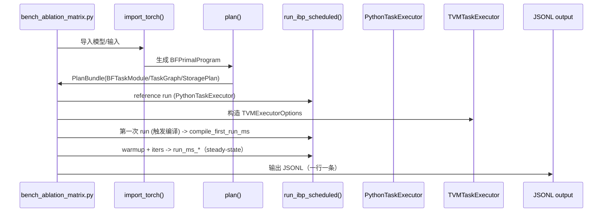

# BoundFlow 全流程：从研究主张到工程实现到论文/AE交付

本文基于仓库已有代码与文档，给出一条“从研究主张到工程实现到论文/AE交付”的完整主线说明。所有结论都附有代码/文档依据；无法在仓库中找到明确证据的部分以 TODO 标注。

---

## 1. 概览（Goals / Non-goals）

**Goals（已在仓库实现/可定位的目标）**

- 把“边界传播/鲁棒性计算”从脚本流程变成可规划、可编译、可审计的系统化管线：前端导入 → Planner → TaskGraph/StoragePlan → Scheduler → Executor（参考 `boundflow/frontends/pytorch/frontend.py:21`、`boundflow/planner/pipeline.py:33`、`boundflow/runtime/scheduler.py:30`）。
- 用 Python reference 保证语义正确性、用 auto_LiRPA 作为可选 baseline 对照：`PythonInterpreter` 和 `PythonTaskExecutor` 提供 reference 路径（`boundflow/runtime/executor.py:17`、`boundflow/runtime/task_executor.py:26`），auto_LiRPA 对齐测试与 bench baseline 可选（`tests/test_phase3_ibp_against_auto_lirpa.py:9`、`tests/test_phase4_task_pipeline_against_auto_lirpa.py:10`、`scripts/bench_ablation_matrix.py:50`）。
- 统一评测输出协议（JSONL）、可流式后处理（CSV/表/图），并有 contract tests：schema 文档与输出位置见 `docs/bench_jsonl_schema.md:1`、`scripts/bench_ablation_matrix.py:431`、`scripts/postprocess_ablation_jsonl.py:215`，contract tests 与 postprocess tests 在 `tests/test_phase5d_pr13d_bench_jsonl_schema_contract.py:14`、`tests/test_phase5d_pr13e_postprocess_jsonl.py:10`、`tests/test_postprocess_enum_normalization.py:6`。

**Non-goals / 当前实现边界（有明确代码证据）**

- 当前 domain 仅实现 interval IBP：`TaskKind.INTERVAL_IBP` 是唯一 kind（`boundflow/ir/task.py:15`），`IntervalDomain` 为主要域实现（`boundflow/domains/interval.py:13`）。
- `scripts/bench_ablation_matrix.py` 当前支持 `workload=mlp/mnist_cnn`，并支持 `--batch/--eps` 参数化（见 `docs/bench_jsonl_schema.md` 的 Workload 参数化小节）。
- artifact runner 已落地：`scripts/run_phase5d_artifact.py` 与 `scripts/run_phase5d_artifact.sh`，产物目录默认写入 `artifacts/phase5d/<run_id>/`（目录已加入 `.gitignore`，不进入 git）。
- TVM 侧对算子覆盖有边界（例如 `TVMTaskExecutor` 中非线性/布局类 op 有 fallback 或未支持分支，`boundflow/runtime/tvm_executor.py:514`）。

---

## 2. 系统架构图（模块图）

```mermaid
graph TD
    A[Workload / Model+Input+eps+Spec] --> B[Frontend: import_torch]
    B --> C[Primal IR: BFPrimalProgram/Graph]
    C --> D[Planner: plan()]
    D --> E[Task IR: BFTaskModule + TaskGraph + StoragePlan]
    E --> F[Scheduler: run_ibp_scheduled]
    F --> G1[PythonTaskExecutor]
    F --> G2[TVMTaskExecutor]
    G2 --> H[TVM Backend Lowering/Compile]
    G1 --> I[Correctness Metrics]
    G2 --> I
    I --> J[Bench JSONL]
    J --> K[Postprocess: CSV/Tables/Figures]
    K --> L[Artifact Runner: run_phase5d_artifact]
```

对应实现入口：
- Frontend：`boundflow/frontends/pytorch/frontend.py:21`
- Primal IR：`boundflow/ir/primal.py:62`
- Planner：`boundflow/planner/pipeline.py:33`
- Task IR/Graph：`boundflow/ir/task.py:89`、`boundflow/ir/task_graph.py:31`
- Scheduler：`boundflow/runtime/scheduler.py:30`
- Executors：`boundflow/runtime/task_executor.py:26`、`boundflow/runtime/tvm_executor.py:65`
- Bench/Postprocess：`scripts/bench_ablation_matrix.py:390`、`scripts/postprocess_ablation_jsonl.py:215`
- Artifact Runner：`scripts/run_phase5d_artifact.py`

---

## 3. 单次实验点时序（含 compile_first_run vs steady-state）



时序关键点的代码依据：
- `compile_first_run_ms` 与 warmup/iters：`scripts/bench_ablation_matrix.py:218`、`scripts/bench_ablation_matrix.py:230`、`scripts/bench_ablation_matrix.py:362`
- JSONL 输出：`scripts/bench_ablation_matrix.py:431`
- JSONL schema 解释：`docs/bench_jsonl_schema.md:39`

---

## 4. 模块拆解（职责 / 输入输出 / 关键 API / 关键结构）

### 4.1 Frontend + Normalizer（导入/规范化）

- 职责：把 PyTorch 模型导入为 Primal IR，并做最小规范化。
- 输入/输出：
  - 输入：`torch.nn.Module` + example inputs
  - 输出：`BFPrimalProgram`（含 `BFPrimalGraph` 与参数绑定）
- 关键 API：
  - `import_torch()`：`boundflow/frontends/pytorch/frontend.py:21`
  - `normalize_primal_graph()`：`boundflow/frontends/normalize.py:3`
- 关键结构：
  - `BFPrimalProgram`、`BFPrimalGraph`、`Node`、`Value`：`boundflow/ir/primal.py:62`

### 4.2 Primal IR（语义层 IR）

- 职责：统一记录节点、输入输出、value 元信息（shape/dtype）。
- 关键结构：
  - `BFPrimalGraph.validate()`：`boundflow/ir/primal.py:62`
  - `ValueKind`（输入/参数/常量/中间）：`boundflow/ir/primal.py:15`

### 4.3 Task IR + TaskGraph + StoragePlan（可执行任务形态）

- 职责：把 Primal Graph 转换为可调度的任务序列与 buffer 级依赖，提供 storage 规划接口。
- 关键结构：
  - `TaskOp` / `BoundTask` / `BFTaskModule`：`boundflow/ir/task.py:89`
  - `StoragePlan`（logical/physical）与 `BufferSpec`：`boundflow/ir/task.py:35`
  - `TaskGraph`（buffer-level deps）：`boundflow/ir/task_graph.py:31`
- 输入/输出：
  - 输入：Primal IR / Planner config
  - 输出：`BFTaskModule` + `TaskGraph` + `StoragePlan`

### 4.4 Planner（单任务/多任务分区与复用）

- 职责：统一 planner 入口、决定分区策略、触发 storage reuse。
- 关键 API：
  - `plan()`（统一入口）：`boundflow/planner/pipeline.py:33`
  - v0 单任务：`plan_interval_ibp_v0()`：`boundflow/planner/interval_v0.py:10`
  - v2 分区：`plan_interval_ibp_v2()`：`boundflow/planner/interval_v2.py:25`
  - Spec 支持：`plan_interval_ibp_with_linear_spec()`：`boundflow/planner/interval_v1.py:13`
  - Storage reuse：`apply_conservative_buffer_reuse()`：`boundflow/planner/passes/buffer_reuse_pass.py:47`
- 关键配置：
  - `PlannerConfig`：`boundflow/planner/core.py:9`
  - `PartitionPolicy`：`boundflow/planner/options.py:8`
  - `StorageReuseOptions`：`boundflow/planner/storage_reuse.py:21`

### 4.5 Scheduler（任务调度）

- 职责：按 TaskGraph 拓扑执行任务，维护 buffer-level env。
- 关键 API：
  - `run_ibp_scheduled()`：`boundflow/runtime/scheduler.py:30`
- 输入/输出：
  - 输入：`BFTaskModule` + `LinfInputSpec` + Executor
  - 输出：`IntervalState`

### 4.6 Executors（Reference vs TVM）

- Python reference：
  - `PythonTaskExecutor.run_ibp()`：`boundflow/runtime/task_executor.py:35`
  - `PythonTaskExecutor.run_ibp_task()`：`boundflow/runtime/task_executor.py:185`
  - `PythonInterpreter`（兼容 Phase 3 API）：`boundflow/runtime/executor.py:17`
- TVM executor：
  - `TVMTaskExecutor` + `TVMExecutorOptions`：`boundflow/runtime/tvm_executor.py:30`
  - `MemoryPlanMode`：`boundflow/runtime/tvm_executor.py:24`
  - `get_task_compile_cache_stats()`：`boundflow/runtime/tvm_executor.py:132`
  - `run_ibp_task()`（任务级 Relax lowering + fallback）：`boundflow/runtime/tvm_executor.py:514`

### 4.7 Domain（Interval IBP）

- 关键实现：`IntervalDomain` / `IntervalState`：`boundflow/domains/interval.py:13`
- 作用：为 `PythonTaskExecutor` 与 `TVMTaskExecutor` fallback 提供算子语义。

### 4.8 TVM Backend Lowering

- 关键文件与 API：
  - `RelaxLoweringMode` 与 `build_interval_linear_relax_ir_module()`：`boundflow/backends/tvm/relax_task_lowering.py:11`
  - `build_interval_task_relax_ops_ir_module()`：`boundflow/backends/tvm/relax_interval_task_ops.py:31`
- 作用：将 TaskOp 序列或单 op lower 为 Relax IRModule，供 TVM executor 编译与缓存。

### 4.9 Bench + JSONL Schema + Postprocess

- Bench：
  - `_bench_one()` 与 JSONL 输出：`scripts/bench_ablation_matrix.py:153`、`scripts/bench_ablation_matrix.py:431`
  - baseline auto_LiRPA（可选）：`scripts/bench_ablation_matrix.py:263`
- JSONL schema 文档：
  - `docs/bench_jsonl_schema.md:1`
- Postprocess：
  - `_flatten_row()`、`_summarize()`、`main()`：`scripts/postprocess_ablation_jsonl.py:67`、`scripts/postprocess_ablation_jsonl.py:166`、`scripts/postprocess_ablation_jsonl.py:215`

### 4.10 Tests（契约/回归）

- JSONL schema contract：`tests/test_phase5d_pr13d_bench_jsonl_schema_contract.py:14`
- postprocess pipeline：`tests/test_phase5d_pr13e_postprocess_jsonl.py:10`
- enum 归一化：`tests/test_postprocess_enum_normalization.py:6`
- env.sh stdout 不污染：`tests/test_env_sh_quiet_stdout.py:12`
- auto_LiRPA 语义对齐：
  - `tests/test_phase3_ibp_against_auto_lirpa.py:9`
  - `tests/test_phase4_task_pipeline_against_auto_lirpa.py:10`

### 4.11 Env（stdout/stderr 约束）

- `env.sh` 默认仅 stderr 输出提示：`env.sh:33`
- 对应回归：`tests/test_env_sh_quiet_stdout.py:12`

---

## 5. Phase 0~6 路线图与验收标准

> 说明：Phase 0/6 在仓库中尚无完整交付实现，已用 TODO 标注。

### Phase 0：问题定义与论文主张（Claims）

- 目标：形成可测量的研究主张与指标口径。
- 关键模块：TODO（仓库未发现专门的 claims 文档/脚本）。
- 验收标准：TODO（建议新增“claims+metrics+threats”文档）。
- 产物：TODO。

### Phase 1：语义正确性打底（Reference semantics）

- 目标：建立 reference 语义与对照基线。
- 关键模块：
  - `IntervalDomain` / `IntervalState`：`boundflow/domains/interval.py:13`
  - `PythonInterpreter` / `PythonTaskExecutor`：`boundflow/runtime/executor.py:17`、`boundflow/runtime/task_executor.py:26`
- 验收标准（已有测试）：
  - `tests/test_phase3_ibp_against_auto_lirpa.py`
- 产物：可对照的 Python reference + auto_LiRPA 对齐测试。

### Phase 2：中间表示与任务化（Task Graph）

- 目标：把 Primal IR 转换为 Task IR 与 TaskGraph，约束 buffer 级契约。
- 关键模块：
  - Primal IR：`boundflow/ir/primal.py:62`
  - Task IR/Graph：`boundflow/ir/task.py:89`、`boundflow/ir/task_graph.py:31`
  - Planner v0/v2：`boundflow/planner/interval_v0.py:10`、`boundflow/planner/interval_v2.py:25`
- 验收标准（已有测试/校验）：
  - `BFPrimalGraph.validate()` 与 `BFTaskModule.validate()` 保证结构一致性
  - `tests/test_ir_primal_validate.py`（文件存在，未展开）
- 产物：稳定的任务化数据结构（TaskOp/StoragePlan/TaskGraph）。

### Phase 3：执行与编译（TVM Executor + caches）

- 目标：打通 TVM 编译与执行，并提供缓存与可观测性。
- 关键模块：
  - `TVMTaskExecutor` + `TVMExecutorOptions`：`boundflow/runtime/tvm_executor.py:30`
  - Relax lowering：`boundflow/backends/tvm/relax_task_lowering.py:11`
- 验收标准（已有测试）：
  - `tests/test_phase4c_tvmexecutor_matches_python.py`
  - `tests/test_phase4c_tvmexecutor_matches_python_cnn.py`
- 产物：TVM 编译执行路径 + compile stats / cache stats。

### Phase 4：系统优化空间（分区/复用/内存规划/融合）

- 目标：落地优化开关并可消融。
- 关键模块：
  - 分区策略：`PartitionPolicy`（`boundflow/planner/options.py:8`）
  - Storage reuse：`StorageReuseOptions`、`apply_conservative_buffer_reuse()`（`boundflow/planner/storage_reuse.py:21`、`boundflow/planner/passes/buffer_reuse_pass.py:47`）
  - TVM memory plan：`MemoryPlanMode`（`boundflow/runtime/tvm_executor.py:24`）
  - Fusion pipeline：`TVMExecutorOptions.enable_task_fusion_pipeline`（`boundflow/runtime/tvm_executor.py:41`）
- 验收标准（已有测试）：
  - `tests/test_phase5b_pr3_buffer_reuse.py`
- 产物：可开关的 planner/executor knob。

### Phase 5：实验产线与系统化消融

- 5D/5E（当前已收口为可交付产线）：
  - 口径冻结：`schema_version=1.0`（`docs/bench_jsonl_schema.md`）
  - Bench：`scripts/bench_ablation_matrix.py`
    - baseline auto_LiRPA：预计算外提 + baseline_key/spec_hash（见 schema 文档）
    - TVM：compile/run 拆分 + compile_stats/call_tir + 可选落盘 cache（`--tvm-cache-dir`）
  - Postprocess：`scripts/postprocess_ablation_jsonl.py`
  - Contract tests：`tests/test_phase5d_pr13d_bench_jsonl_schema_contract.py`、`tests/test_phase5d_pr13e_postprocess_jsonl.py`
  - Artifact runner：`scripts/run_phase5d_artifact.py`、`scripts/run_phase5d_artifact.sh`
  - Claims/Appendix：`gemini_doc/artifact_claims_phase5d.md`、`gemini_doc/artifact_appendix_phase5d.md`

### Phase 6：论文叙事 + Artifact 打包

- 目标：在 Phase 5 冻结口径基础上扩展更强性质/更大规模实验，不回滚 Phase 5 的 schema/产线。
- 现状：Phase 5 的 runner/claims/appendix 已具备，Phase 6 主要是扩 domain/算法与论文叙事（例如 CROWN/α-CROWN/BaB、cache/batching、layout 全局优化等）。

---

## 6. 扩展指南与最佳实践（Checklist）

### 6.1 新增 workload

1. 在 `scripts/bench_ablation_matrix.py` 中扩展 `_build_workload()` 与 `--workload` choices（`scripts/bench_ablation_matrix.py:124`、`scripts/bench_ablation_matrix.py:392`）。
2. 若输入形状或 eps 可参数化，沿用 `--batch/--eps` 逻辑，确保 JSONL group key 可区分（`docs/bench_jsonl_schema.md:86`）。
3. 更新或新增对齐测试（如有 auto_LiRPA baseline），参考 `tests/test_phase4_task_pipeline_against_auto_lirpa.py:10`。
4. 若新增域或算子，补齐 `IntervalDomain` / executor fallback（`boundflow/domains/interval.py:22`、`boundflow/runtime/task_executor.py:35`）。

### 6.2 新增 knob（planner 或 TVM 选项）

1. 在 `PlannerConfig` 或 `TVMExecutorOptions` 添加字段（`boundflow/planner/core.py:9`、`boundflow/runtime/tvm_executor.py:30`）。
2. 在 `scripts/bench_ablation_matrix.py` 中接入 CLI 参数与 JSONL 输出（`scripts/bench_ablation_matrix.py:390`、`scripts/bench_ablation_matrix.py:303`）。
3. 视需要更新 `scripts/postprocess_ablation_jsonl.py` 的 `_flatten_row()` / `_group_key()`（`scripts/postprocess_ablation_jsonl.py:67`、`scripts/postprocess_ablation_jsonl.py:147`）。
4. 更新 `docs/bench_jsonl_schema.md`，并按 `docs/phase5E.md:31` 提示 bump `schema_version`。
5. 更新契约测试 `tests/test_phase5d_pr13d_bench_jsonl_schema_contract.py`。

### 6.3 新增 schema 字段或升级 schema_version

1. 修改 `scripts/bench_ablation_matrix.py` 输出字段（`scripts/bench_ablation_matrix.py:303`）。
2. 更新 `docs/bench_jsonl_schema.md` 字段说明（`docs/bench_jsonl_schema.md:13`）。
3. bump `schema_version` 并同步更新 contract tests（`tests/test_phase5d_pr13d_bench_jsonl_schema_contract.py:41`）。
4. 更新 `scripts/postprocess_ablation_jsonl.py` 的扁平化/汇总字段（`scripts/postprocess_ablation_jsonl.py:67`）。

### 6.4 更新 postprocess

1. 修改 `_flatten_row()` 与 `_summarize()`（`scripts/postprocess_ablation_jsonl.py:67`、`scripts/postprocess_ablation_jsonl.py:166`）。
2. 更新 `tests/test_phase5d_pr13e_postprocess_jsonl.py` 的样例断言。
3. 如新增 enum/字符串格式，更新 `_normalize_enum_repr()` 与测试（`scripts/postprocess_ablation_jsonl.py:47`、`tests/test_postprocess_enum_normalization.py:6`）。

---

## 7. 代码阅读路线（推荐顺序）

1. **Primal IR 与 Value 语义**：先看 `boundflow/ir/primal.py`，建立“Node/Value/Graph”的心智模型。
2. **Frontend 导入与规范化**：`boundflow/frontends/pytorch/frontend.py`、`boundflow/frontends/normalize.py`，理解算子映射与最小规范化策略。
3. **Task IR 与 Planner**：`boundflow/ir/task.py`、`boundflow/planner/interval_v0.py`、`boundflow/planner/interval_v2.py`、`boundflow/planner/pipeline.py`，理解任务化与分区策略。
4. **TaskGraph 与 Scheduler**：`boundflow/ir/task_graph.py`、`boundflow/runtime/scheduler.py`，理解 buffer 级依赖与调度。
5. **Reference Executor**：`boundflow/runtime/task_executor.py`、`boundflow/runtime/executor.py`，掌握语义正确性路径。
6. **TVM Backend/Executor**：`boundflow/backends/tvm/relax_task_lowering.py`、`boundflow/backends/tvm/relax_interval_task_ops.py`、`boundflow/runtime/tvm_executor.py`，理解 compile/cache/VM 行为。
7. **Bench + Schema + Postprocess**：`scripts/bench_ablation_matrix.py`、`docs/bench_jsonl_schema.md`、`scripts/postprocess_ablation_jsonl.py`，掌握实验产线。
8. **Contract Tests/Env**：`tests/test_phase5d_pr13d_bench_jsonl_schema_contract.py`、`tests/test_phase5d_pr13e_postprocess_jsonl.py`、`tests/test_env_sh_quiet_stdout.py`，理解复现保障。

---

## 8. 关键“为什么”（JSONL / stdout / contract test / warmup 拆分）

**为什么 JSONL**

- 项目明确规定 JSONL 作为统一评测输出，并要求“一行一条”以支持流式/增量（`docs/bench_jsonl_schema.md:3`）。
- bench 脚本以 JSONL 作为唯一标准输出（`scripts/bench_ablation_matrix.py:431`）。

**为什么 stdout 必须纯 payload（stderr 打日志）**

- `env.sh` 明确将提示输出到 stderr，避免污染 stdout（`env.sh:33`）。
- 对应回归测试保证 stdout 为空（`tests/test_env_sh_quiet_stdout.py:12`）。

**为什么要 schema contract tests**

- JSONL schema 已被固定并文档化（`docs/bench_jsonl_schema.md:5`），contract tests 直接运行 bench 并检查字段与类型（`tests/test_phase5d_pr13d_bench_jsonl_schema_contract.py:14`）。

**为什么要 warmup vs steady-state 拆分**

- bench 逻辑显式区分首次运行（触发编译）与 steady-state（`scripts/bench_ablation_matrix.py:218`、`scripts/bench_ablation_matrix.py:230`），并输出 `compile_first_run_ms` 与 `run_ms_p50/p95`（`scripts/bench_ablation_matrix.py:362`）。
- schema 文档也将其定义为强约束（`docs/bench_jsonl_schema.md:39`）。

---

## TODO 汇总（仓库未发现直接实现的部分）

- Phase 0 claims 文档与明确指标定义：TODO（仓库暂无对应文件）。
- 论文图表口径/编号的最终定稿化：TODO（当前已能产出 `table_main.csv` 与 speedup 图，但论文 figure/table 编号映射仍可进一步精炼）。
- 更大规模 workload/更强 domain：TODO（Phase 6）。

## 附：Phase 5D/5E 收口入口

- 一键 runner（产 JSONL/CSV/表/图/MANIFEST）：`scripts/run_phase5d_artifact.py`
- Claims/证据映射（口径源文档）：`gemini_doc/artifact_claims_phase5d.md`
- AE Appendix（如何运行/如何验证）：`gemini_doc/artifact_appendix_phase5d.md`
- Phase 5 完成声明（工程收口/口径冻结）：`docs/phase5_done.md`
